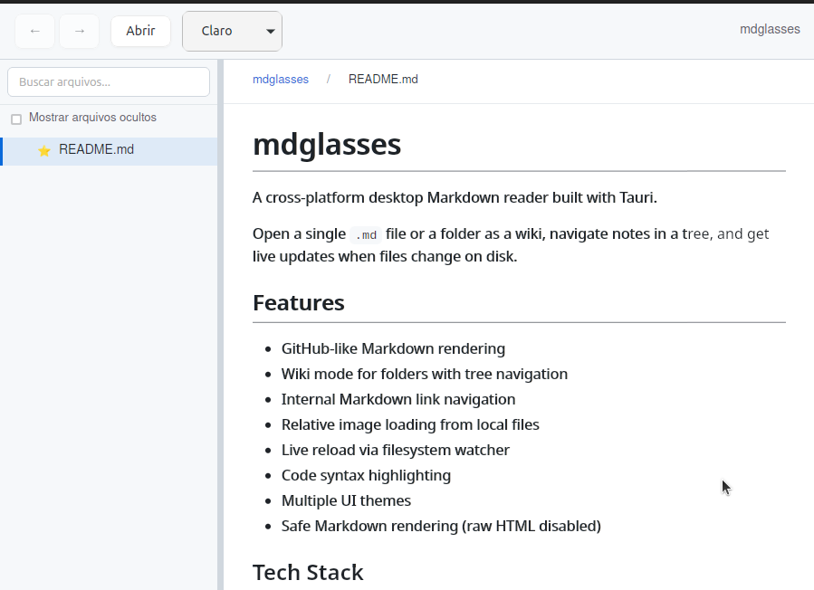
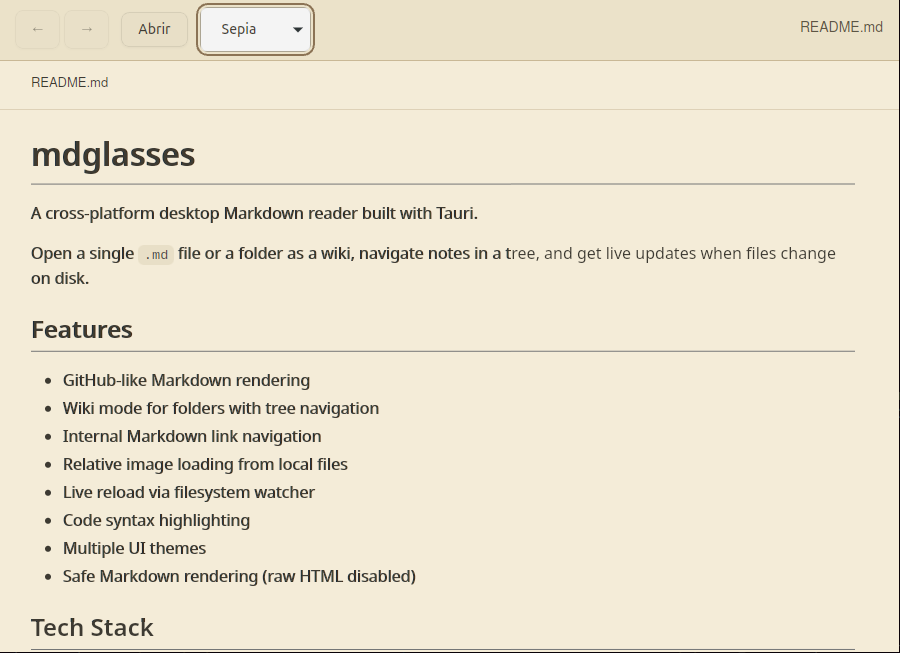
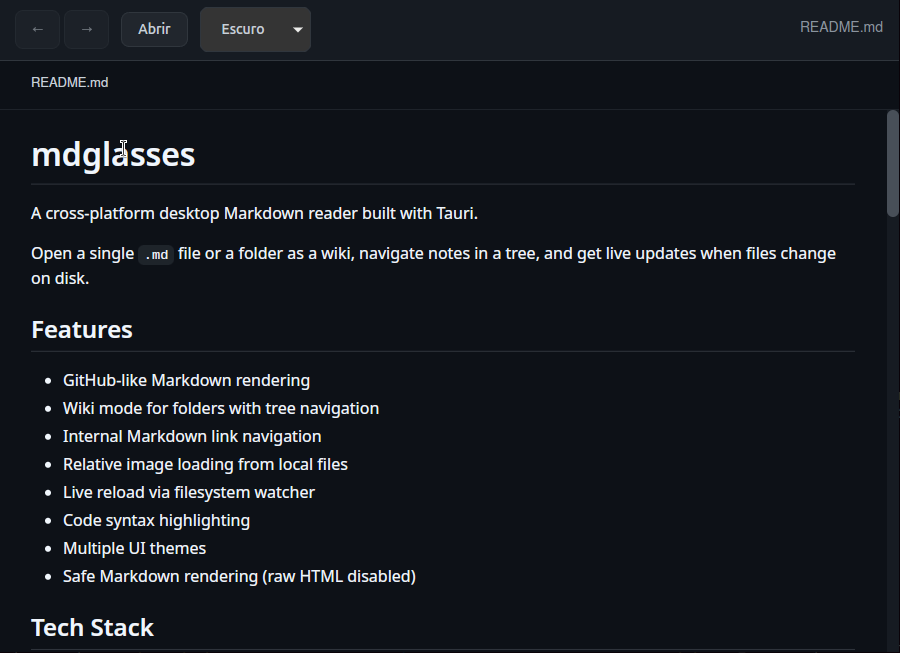

# mdglasses

Cross-platform desktop Markdown reader built with Tauri.

Open a single `.md` file or an entire folder in wiki mode with tree navigation, internal links, and live reload from disk.

## Screenshots





## Why mdglasses

- Read local Markdown with a GitHub-like look directly on desktop.
- Browse note collections as a wiki with tree view, breadcrumb, and history.
- Use standard Markdown links and `[[wikilinks]]` in the same workflow.
- Get automatic refresh when files change on disk.
- Copy code blocks in one click and switch between light/sepia/dark themes.

## Key features

### Navigation

- Wiki mode for folders with a `.md` file tree
- Tree search, breadcrumb, and navigation history (`Alt+Left` / `Alt+Right`)
- Single **Open** action for both folder (wiki) and single-file flows

### Rendering

- GitHub-like Markdown rendering
- Support for Markdown links and `[[wikilinks]]` (Obsidian-style)
- Local relative image loading
- Syntax highlighting powered by `highlight.js`

### UX

- Auto-reload via file watcher
- **Copy** button for code blocks
- Interface themes: light, sepia, and dark

### Security

- Safe rendering with raw HTML disabled (`comrak` with `unsafe_ = false`)
- HTML/scripts inside Markdown content are not executed
- Local assets resolved via Tauri asset protocol

## Quick start

### Requirements

- Node.js 18+ and npm
- Rust stable toolchain (`rust-version = 1.77`)
- Tauri platform dependencies:
  - Linux (Ubuntu/Debian): WebKitGTK/GTK development packages
  - macOS: Xcode Command Line Tools
  - Windows: Visual Studio Build Tools (C++) + WebView2

On Linux, you can use:

```bash
bash scripts/install-deps-linux.sh
```

### Run locally

```bash
npm install
npm run tauri dev
```

This starts Vite + Tauri with hot reload.

## Useful commands

| Command | Description |
| --- | --- |
| `npm run dev` | Frontend in browser with Vite |
| `npm run tauri dev` | Full desktop app in development mode |
| `npm run tauri:dev` | Linux fallback (forces X11 + disables compositing) |
| `npm test` | Frontend tests (Vitest) |
| `npm run test:rust` | Rust tests |

## Build & release

```bash
npm run tauri build
```

Main artifacts:

- Binary: `src-tauri/target/release/mdglasses`
- Bundles: `src-tauri/target/release/bundle/` (`.deb`, `.rpm`, etc.)

In some CI environments:

```bash
CI=false npm run tauri build
```

To run the release binary locally:

```bash
bash scripts/run-release.sh
```

## Usage flow

1. Click **Open**.
2. The folder picker opens first.
3. If you select a folder, the app opens wiki mode with a `.md` tree; if you cancel, it opens single-file picker.
4. In wiki mode, use tree search, breadcrumb, internal links, and history (`Alt+Left` / `Alt+Right`).
5. In code blocks, use **Copy** in the top-right corner.

## Troubleshooting

Blank window on Linux (some Wayland/WebKitGTK setups):

```bash
npm run tauri:dev
```

Port `1420` already in use:

```bash
lsof -ti:1420 | xargs -r kill
```

## Tech stack

- Frontend: TypeScript + Vite
- Desktop: Tauri v2
- Markdown rendering: `comrak` (Rust)
- Code highlighting: `highlight.js`

## Security

- Markdown rendered in safe mode with raw HTML disabled
- Embedded scripts from Markdown content are not executed
- Local files resolved via the Tauri asset protocol

## License

Licensed under **MIT** - see [LICENSE](LICENSE).
